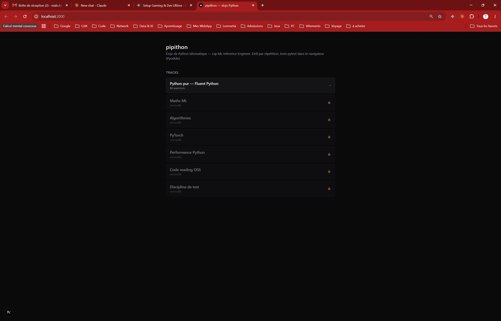
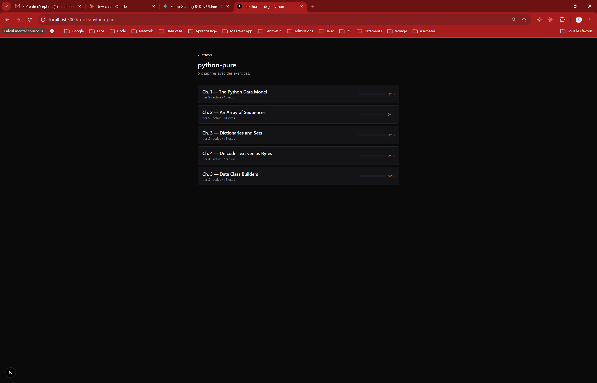
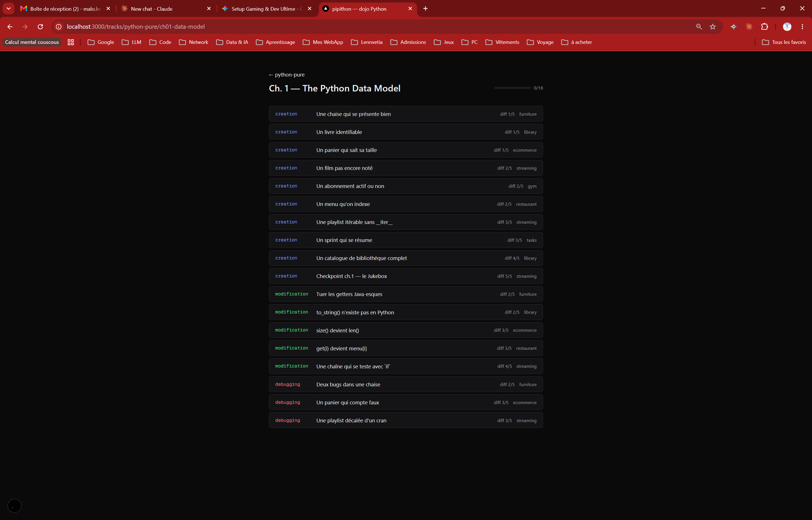
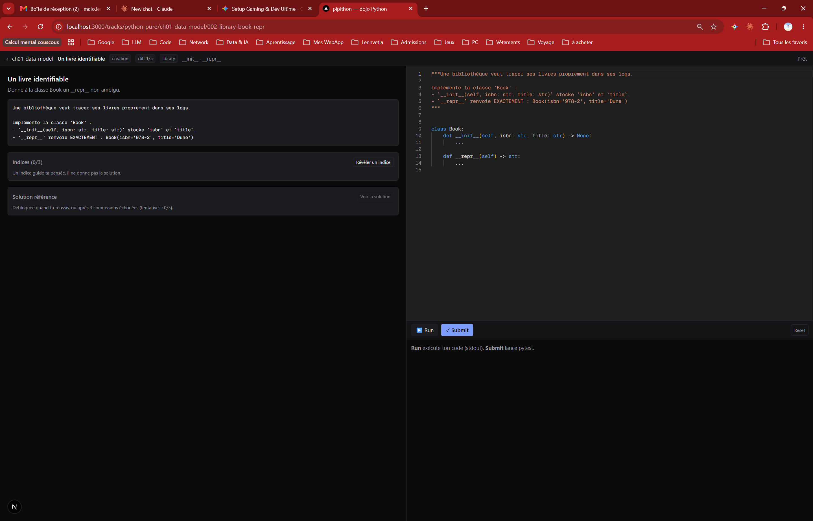

# pipithon

Dojo personnel d'entraînement au code. Webapp **mono-utilisateur** qui drille du
Python idiomatique (puis maths ML, algos, PyTorch, code-reading) via des exercices
à 3 types — `creation` / `modification` / `debugging` — exécutés et testés
**dans le navigateur** avec Pyodide + pytest (zéro backend). Finalité : préparer un
profil *ML Inference Engineer* (cf. `docs/context/mapping-mistral.md`).

## Aperçu

| Home — tracks | Track — chapitres | Chapitre — exos | Workbench — Monaco + pytest |
|---|---|---|---|
|  |  |  |  |

## Stack en bref

- **Frontend** : Next.js 15 (App Router) + TypeScript, Tailwind v4, Monaco.
- **Exécution** : Pyodide (CPython WASM) + pytest, 100 % client-side.
- **Persistance** : `localStorage` (progression + brouillons). Pas de backend.
- **Exos** : YAML + 3 fichiers `.py` versionnés Git, scannés au build.
- **Déploiement** : Vercel, Root Directory = `web/`.

## Lancer en dev

`pnpm` doit être sur le PATH (`npm install -g pnpm` si besoin) :

```bash
cd web
pnpm install      # première fois
pnpm dev          # http://localhost:3000
```

Tooling Python (validation des exercices) :

```bash
python tools/validate_all.py
```

## Où regarder pour comprendre

`CLAUDE.md` à la racine est le **manuel d'opération** : stack, pédagogie, format
des exercices, et le runbook « si on te dit X, fais Y ». Le détail long vit dans
`docs/` : `pedagogy.md`, `exercise-format.md`, `themes.md`,
`generation-recipes.md`, et le curriculum par chapitre dans
`docs/curriculum/python-pure/`. Le cadrage produit/pédagogie d'origine est figé
dans `INIT_PROMPT.md`.
